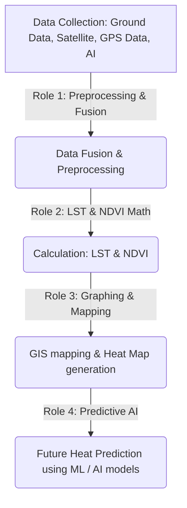

# 🌡️ Urban Heat Island Mapping & Predictive GIS Analytics System

Welcome to the **Urban Heat Island (UHI) Mapping & Analytics System**. This repository serves as a modular, high-end collaborative codebase designed for **Theory Project Group 4 (CSE 3-2)**.

The system focuses on a high-resolution micro-analysis of **Mirpur 12** as the baseline ground-truth deployment and scales dynamically to divisional boundaries across Bangladesh: **Entire Dhaka Metropolitan Area**, **Sylhet**, **Rajshahi**, and **Chittagong**. It fuses satellite remote sensing data (specifically Land Surface Temperature and vegetation canopy ratios) with ground-truth sensor parameters to process thermal anomalies, apply machine learning models to predict future temperatures, and support sustainable urban planning. The system processes everything using a unified Python data pipeline.

---

## 🌐 Strategic Project Charter

### 🎯 Project Purpose & Objectives
Rapid urbanization across Bangladesh has replaced natural green canopies with heat-absorbing concrete pavements and high-density multi-story structures. The purpose of this project is to model and visualize this **Urban Heat Island (UHI) effect** to identify thermal hotspots, analyze their environmental causes, and predict temperatures based on vegetation coverage.
- **Identify Micro-Thermal Anomalies:** Locate localized heat zones (down to street/alley levels like the Mirpur 12 Bus Stand and Metro Station) that standard macro-climatic tools miss.
- **Model Vegetation Influence:** Calculate the exact mathematical inverse correlation between green cover indices (NDVI) and surface temperature.
- **Support Strategic Cooling:** Provide city planners with data-backed locations to deploy green roofs, parks, and water bodies to cool the city.

### 👥 Stakeholders & Beneficiaries (How They Benefit)
* **Municipal Corporations (e.g., DNCC, DSCC):**
  - *Benefit:* Obtain hyper-local thermal risk maps to optimize the layout of urban cooling zones and community parks.
* **Urban Planners & Architects:**
  - *Benefit:* Acquire concrete-to-vegetation data sheets to design heat-resilient building envelopes, green building guidelines, and low-heat pavements.
* **General Citizens & Residents:**
  - *Benefit:* View active regional thermal alerts to plan outdoor activities, reduce heatstroke risks, and locate nearby cooling zones.
* **Environmental Research Bodies & Academic Institutions:**
  - *Benefit:* Access a unified platform blending ground-truth coordinates with satellite LST outputs to study climate changes in rapidly growing cities.

### 📈 Expected Impacts
* **Mitigated Energy Consumption:** Pinpointing hotspots enables targeted tree planting, lowering surrounding temperatures by 2–4°C and cutting air conditioning power demands by up to 15%.
* **Optimized Public Health Planning:** Provides local hospitals and authorities with heat risk assessments, helping to lower heat-related illnesses among vulnerable demographics (like field workers and children).
* **Informed Policy Guidance:** Helps establish sustainable city laws, such as mandating minimum green space requirements for new construction projects.

---

## ⚔️ The Strategic Advantage: Over Google's Features

Standard GIS tools (like the Google Environmental Insights Explorer or Google Earth Engine Tree Canopy tool) provide valuable macro datasets. However, this system offers distinct advantages for developing regions:

| Feature Dimension | Google Environmental Insights | This UHI GIS Project |
| :--- | :--- | :--- |
| **Data Granularity** | Macro-level estimates (often broad grid scales). | **Hyper-local resolution** incorporating side-streets, DOHS parks, and bus stands. |
| **Ground-Truth Calibration** | Purely satellite-derived estimates without ground verification. | **Hybrid Data Fusion** combining Landsat/Sentinel LST with synthesized ground sensor coordinates. |
| **Update Frequency** | Refreshed annually or bi-annually in developing regions. | **Real-time capabilities** allowing instant uploads of manual field sensor logs. |
| **Interactive Simulation** | Static viewing of green cover percentages. | **Interactive Regression Engine** allowing planners to simulate how expanding green canopy impacts localized heat. |
| **Local Customization** | Built on global standard presets, ignoring localized Bangladesh building materials. | **Context-specific parameters** (such as high-traffic metro hubs, local soil, and asphalt structures). |

---

## 🛠️ Technological Stack & Tools Used

The system is built entirely on a pure Python-based data processing, visualization, and machine learning pipeline (no frontend/backend web servers):
* **Data Processing & Analytics:** **Pandas** (CSV database parsing), **NumPy** (matrix operations), and **Scikit-Learn** (regression and advanced AI model prediction engine).
* **Spatial/Satellite Assets:** Google Earth Engine (GEE), QGIS, USGS Earth Explorer (Landsat 8/9 thermal bands, Sentinel-2 optical bands).
* **Plotting & Visualization:** **Matplotlib**, **Seaborn**, **Folium** (for interactive GIS mapping and heatmap overlays), and **Plotly** (for comparative analytics graphs).

---

## 🗺️ System Architecture & Workflow

Understanding the data flow is key to smooth team integration. The system processes everything using a unified Python pipeline through the following stages:



---

## 👥 Team Roles & Collaboration Blueprint

To prevent merge conflicts and define clear engineering boundaries, the work is divided into four highly-focused roles as assigned:

### 📡 Role 1: Data Collection & Data Preprocessing
* **Assigned to:** Sayed, Nusair
* **Core Mandate & Technical Role:**
  1. Acquire ground data, satellite parameters (thermal/infrared bands from Landsat 8/9 or Sentinel-2), and GPS coordinates.
  2. Perform data cleaning, merging, and preprocessing to prepare the dataset for calculations.
  3. Ensure seamless data fusion of remote sensing telemetry and ground-truth coordinates.

---

### ✍️ Role 2: Calculation & Report Writing
* **Assigned to:** Punam, Nafiz
* **Core Mandate & Technical Role:**
  1. Implement mathematical calculations for **Normalized Difference Vegetation Index (NDVI)** and **Land Surface Temperature (LST)**.
  2. Compute physical indices and coordinate with the team to validate core calculation scripts.
  3. Lead report authoring, documentation stability, and viva simulation rehearsals.

---

### 🎨 Role 3: Dataset Plotting & Visualization
* **Assigned to:** Spondon, Rushafi
* **Core Mandate & Technical Role:**
  1. Generate static and interactive **Heat maps** using spatial GIS coordinate layers.
  2. Perform comprehensive **GIS mapping** overlays showing localized thermal distribution.
  3. Render **Comparative graphs** (e.g., Concrete vs. Vegetated surfaces) showing statistical distributions.

---

### 🧠 Role 4: Predictive Analysis (ML)
* **Assigned to:** Ajwad, Sabbir
* **Core Mandate & Technical Role:**
  1. Build and train different **AI / Machine Learning models** to predict future temperatures.
  2. Train regression models and advanced AI algorithms on the merged preprocessed datasets.
  3. Evaluate fit quality and compute error metrics: Mean Absolute Error (MAE), Root Mean Squared Error (RMSE), and Coefficient of Determination ($R^2$ Score).

---

## 📊 Shared Data Contract (Pipeline Data Schema)

To keep all data pipeline components (Preprocessing, Calculation, Plotting, and ML) aligned, the standardized internal data structure passed between modules adheres to this schema:

```json
{
  "region": "mirpur12",
  "name": "Mirpur 12",
  "description": "Hyper-local baseline micro-analysis...",
  "analytics": {
    "alpha_intercept": 37.8331,
    "beta_slope": 13.3629,
    "avg_temp": 33.43,
    "r2_score": 0.9498,
    "rmse": 0.661,
    "mae": 0.5963,
    "peak_hotspot": {
      "name": "Ceramic Factory Area",
      "temp": 38.1,
      "lat": 23.8205,
      "lng": 90.3685
    },
    "peak_coolspot": {
      "name": "DOHS Lake Side Walkway",
      "temp": 28.5,
      "lat": 23.827,
      "lng": 90.363
    }
  },
  "records": [
    {
      "LocationID": 1,
      "LocationName": "Mirpur 12 Metro Station",
      "Latitude": 23.8248,
      "Longitude": 90.3621,
      "Temperature": 37.2,
      "SurfaceType": "Concrete",
      "NDVI": 0.08,
      "TrafficDensity": "High",
      "Time": "Afternoon"
    }
  ]
}
```

---

## 📐 Mathematical Equations

### 1. Land Surface Temperature (LST) Calculation
The core predictive regression model calculates surface temperature based on vegetation index correlation:
$$\text{Predicted Temperature} = \alpha - (\beta \times \text{NDVI})$$
Where:
- $\alpha$: Intercept (base temperature without green cover)
- $\beta$: Slope (cooling efficiency per unit of green canopy expansion)

### 2. Normalized Difference Vegetation Index (NDVI) Calculation
NDVI calculates vegetation density using near-infrared (NIR) and red light bands:
$$\text{NDVI} = \frac{\text{NIR} - \text{Red}}{\text{NIR} + \text{Red}}$$

---

## 🎨 Proposed Final Projection Preview
Below is the visual projection mockup of the GIS mapping results generated by the pipeline:


---

## 🏃 Quick-Start Development Guide

Follow these steps to execute the Python data pipeline locally:

### 1. Set Up Your Environment
Ensure Python 3 is installed, then install the required data-science, plotting, and machine learning dependencies:
```bash
pip install pandas numpy matplotlib seaborn folium scikit-learn --break-system-packages
```
*(Use `--break-system-packages` if developing on modern macOS with externally-managed Python environments, or activate a virtual environment).*

### 2. Run the Data Pipeline
Execute the main execution script from the root of the project directory to perform data fusion, run calculations, generate visual heatmaps, and train prediction models:
```bash
python main.py
```
*(Ensure all preprocessed CSV inputs and satellite LST data are loaded in the `data/` folder before execution).*

---
