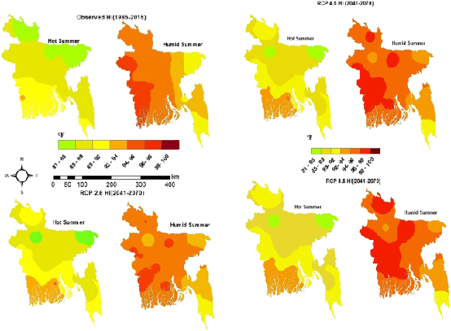

# 🌡️ Urban Heat Island GIS & Predictive ML Analytics

This document outlines the core workflow constraints, mathematical models, and role distributions for the **Theory Project Group 4 (CSE 3-2)**.

---

## 🎨 Proposed Final Projection Preview
Below is the visual mockup of our GIS heatmap results generated by the pipeline:



---

## ⚙️ Core Architecture Constraints
- **Pipeline Ecosystem**: Pure Python data-science processing (no web frontend or Flask/Django backend).
- **Core Addition**: Dynamic machine learning (ML/AI) models trained to forecast future localized temperatures.

---

## 🔄 Main Pipeline Workflow
```
Data Ingestion (Ground & Sat GPS) ──> Data Preprocessing & Fusion ──> Calculation (LST & NDVI) ──> GIS Plotting & Mapping ──> Machine Learning Future Prediction
```

---

## 📐 Core Mathematical Formulations

### 1. Land Surface Temperature (LST) Predicted Equation
Calculates predicted surface temperature based on vegetation index correlation:
$$\text{Predicted Temperature} = \alpha - (\beta \times \text{NDVI})$$
Where:
- $\alpha$: Intercept temperature (base thermal profile without green canopy)
- $\beta$: Slope coefficient (cooling efficiency of green canopy expansion)

### 2. Normalized Difference Vegetation Index (NDVI)
NDVI determines green canopy ratios using Near-Infrared (NIR) and Red bands:
$$\text{NDVI} = \frac{\text{NIR} - \text{Red}}{\text{NIR} + \text{Red}}$$

### 3. Heat Risk Index (HRI)
Combines normalized LST and NDVI into a composite exposure score:
$$\text{HRI} = \text{norm(LST)} \times (1 - \text{norm(NDVI)})$$

Where:
- $\text{norm(LST)} = \dfrac{\text{LST} - 10}{65 - 10}$, clipped to $[0, 1]$
- $\text{norm(NDVI)} = \dfrac{\text{NDVI} - (-0.3)}{0.8 - (-0.3)}$, clipped to $[0, 1]$

Risk categories: **Very Low** (0–0.2), **Low** (0.2–0.4), **Moderate** (0.4–0.6), **High** (0.6–0.8), **Extreme** (0.8–1.0).

Exposed via `GET /api/heat-risk?region={id}` in `backend/app.py`; calculation logic in `pipeline/heat_risk.py`.

### 4. Future Temperature Prediction
Trains a pluggable regression model on historical annual mean temperatures and projects forward:
$$\text{Predicted Temperature}_{t+k} = f(\text{Year} + k) + \text{regional offset}$$

Default model: linear regression on `field_data/mirpur_historical_temperatures.csv`. Regional baseline calibrated from `ml_models/{region}_reg_metrics.json`.

Exposed via `GET /api/predict-temperature?region={id}`; modular engine in `pipeline/temperature_prediction/`.

### 5. Tree Plantation Recommendations
Identifies high-temperature, low-NDVI priority areas and estimates vegetation deficit:
$$\text{Vegetation Deficit} = \text{norm(LST)} \times (1 - \text{norm(NDVI)})$$

Intervention tiers: **Small**, **Moderate**, **Aggressive**. Suggested actions include tree plantation, green roofs, vertical gardens, and community parks.

Exposed via `GET /api/recommendations?region={id}`; modular engine in `pipeline/recommendations/`.

### 6. Climate Resilience Score
Composite 0–100 score from equally weighted NDVI, average temperature, Heat Risk Index, and green coverage percentage. Categories: **Critical**, **Poor**, **Moderate**, **Good**, **Excellent**.

Exposed via `GET /api/climate-score?region={id}`; modular engine in `pipeline/climate_resilience/`.

### 7. Heatwave Alerts
Monitors temperature readings and triggers alerts when thresholds are exceeded: **Warning** (>35°C), **Severe** (>38°C), **Extreme** (>40°C).

Exposed via `GET /api/alerts?region={id}`; modular engine in `pipeline/heatwave_alerts/` with pluggable `BaseAlertNotifier` for future SMS/push delivery.

### 8. GeoJSON Regional Analytics
Accepts validated GeoJSON polygon uploads and computes average temperature, NDVI, and Heat Risk Index for observation points inside the polygon boundary.

Exposed via `POST /api/analyze-region`; modular engine in `pipeline/geo_analytics/` with pluggable geometry adapters for future shapefile support.

### 9. Hotspot Ranking
Ranks all analyzed regions and returns the top 10 hottest locations by temperature or Heat Risk Index, including coordinates and risk level.

Exposed via `GET /api/hotspots`; modular engine in `pipeline/hotspot_ranking/`.

### 10. Environmental Report Generator
Automated per-region reports combining temperature/NDVI statistics, Heat Risk Index, climate score, and recommendations. Exports JSON or PDF via pluggable `BaseReportExporter` classes.

Exposed via `GET|POST /api/report`; modular engine in `pipeline/report_generator/`.

### 11. Green Infrastructure Simulation
Simulates +10%, +20%, and +30% NDVI increases and estimates temperature reduction using the regional regression model `Temperature = α - (β × NDVI)`.

Exposed via `GET|POST /api/simulate-green-growth`; modular engine in `pipeline/green_simulation/`.

### 12. Environmental Decision Support System (EDSS)
Aggregates LST, NDVI, Heat Risk Index, climate score, and recommendations into ranked policy suggestions (tree coverage, pocket parks, cool pavements, rooftop gardens) with Critical/High/Medium/Low priority.

Exposed via `GET|POST /api/decision-support`; clean architecture in `pipeline/edss/`.

---

## 👥 Assigned Project Roles

1. **Data Ingestion & Preprocessing**: Sayed, Nusair  
   *Ingestion, data cleaning, and dataset merging.*
2. **Calculation & Report Writing**: Punam, Nafiz  
   *NDVI & LST math execution and chief academic documentation.*
3. **Dataset Plotting & GIS Mapping**: Spondon, Rushafi  
   *Interactive GIS maps (Folium) and Matplotlib regression plots.*
4. **Predictive Analysis (ML)**: Ajwad, Sabbir  
   *AI regression training and forecast quality evaluations.*

---
